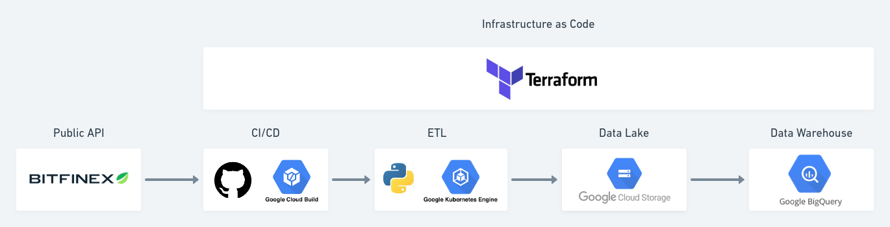

# [GCP] Data Lake and Analytics
Creating a data lake using Terraform and Google Cloud stack for analytics purpose. The objective of this project is to consume from a public API data and send to a infrastructure to analyze by using BigQuery.

## Summary
- [[GCP] Data Lake and Analytics](#gcp-data-lake-and-analytics)
  - [Summary](#summary)
  - [1. Start](#1-start)
  - [2. Main Architecture](#2-main-architecture)
  - [3. ETL, Data Lake and Data Warehouse](#3-etl-data-lake-and-data-warehouse)
    - [3.1 ETL](#31-etl)
    - [3.2 Data Lake](#32-data-lake)
    - [3.3 Data Warehouse](#33-data-warehouse)

## 1. Start
1. Clone the repo here:
``` bash
git clone https://github.com/israelmendez232/gcp-data-lake-analytics.git
cd ./gcp-data-lake-analytics/
```

2. Clone and change the name of the `.env-sample` file:
``` bash
cp .env-sample .env
```

3. Modify the `.env` file to have all the credentations needed.

4. To test the code locally, just use Docker to start:
``` bash
docker build -t gcp-data-lake-analytics/etl:1.0 .
```

4. Run the image:
``` bash
docker run --env-file .env gcp-data-lake-analytics/etl:1.0
```

## 2. Main Architecture
Here is the diagram to visualize:


The stack:
1. **Public API:** collect data using a financial API, because of the frequency of the data to be quite high in this market. Specially on crypto. Also choosed the [Bitfinex API v2](https://docs.bitfinex.com/docs/introduction) because they have a good documentation and to collect the main data doesn't need to be authenticated;
2. **ETL:** decided to use Python with [Google Kubernetes Engine (GKE)](https://cloud.google.com/kubernetes-engine?hl=pt-br) to store the code;
3. **Data Lake:** using [Cloud Storage](https://cloud.google.com/storage?hl=pt-br) to save encoded [.parquet](https://cloud.google.com/bigquery/docs/loading-data-cloud-storage-parquet?hl=pt-br#:~:text=Parquet%20%C3%A9%20um%20formato%20de,%2C%20bem%20como%20substitu%C3%AD%2Dlas.) files as structured data;
4.  **CI/CD:** to use GitHub to store the code and modifications, such as the documention on this README. And use [Cloud Build](https://cloud.google.com/build?hl=pt-br) to connect to the repository and update the GKE envoiroment;
5.  **Data Warehouse:** read the data transformed from [Cloud Storage](https://cloud.google.com/storage?hl=pt-br) from [BigQuery](https://cloud.google.com/bigquery?hl=pt-br);
6.  **Infrastructure as Code:** decided to manage and script all infrastructure using [Terraform](https://www.terraform.io/).

## 3. ETL, Data Lake and Data Warehouse

### 3.1 ETL
The code is on `./app` folder ([here](https://github.com/israelmendez232/gcp-data-lake-analytics/tree/main/app)). It's ran on:
- **Docker:** to configure the envoiroment and to run the code with the dev cloud resources to test it;
- **ETL:** which is separated in each zone;
  - `raw_zone`: Code that collects the JSON from the [Bitfinex API v2](https://docs.bitfinex.com/docs/introduction) and saves on [Cloud Storage](https://cloud.google.com/storage?hl=pt-br);
  - `trusted_zone`: Transform the JSON on a structured format and saves on [Cloud Storage](https://cloud.google.com/storage?hl=pt-br), in .parquet. Partitioning by day;
  - `analytics_zone`: Collects the last partition on `trusted` and run a few technical analysis calculations by each data to provide a more analytical view.

The code runs each 5 minutes, to extract the data and make the transformations.
### 3.2 Data Lake
The objective here is to divide the data lake in zones to avoid repeating code and provide a better envoiroment for data quality. 
1. **Raw:** Receive the raw data, such as .json or .csv - No transformation and neighter a partition now
1. **Trusted:** Retreive the data in raw, transform in a structured format and encoded in .parquet - Partition by date
1. **Analytics:** Get the data in trusted, run all the complex aggregations and main tables, without the need for partitioning, for consumption of the final user. In analytics we will have the more complex calculations such as data marts and OLAPs cubes.

Here is a table to explain better:
| **Zones** | **File**          | **Partition** | **Source**            |
|-----------|-------------------|---------------|-----------------------|
| Raw       | .json/.csv/others | No            | System of Record      |
| Trusted   | .parquet          | Yes           | Raw                   |
| Analytics | .parquet          | No            | Trusted + Custom Code |

### 3.3 Data Warehouse
To consume to data, BigQuery will provide visualization for `trusted` and `analytics`. Reading directly from [Cloud Storage](https://cloud.google.com/storage?hl=pt-br). The objective is to break by these types of access to manage:
| **Type of User** | **Example**                      | **Raw (Cloud Storage)** | **Trusted (BigQuery)** | **Analytics (BigQuery)** |
|------------------|----------------------------------|-------------------------|------------------------|--------------------------|
| Essencial        | Marketing, Product               | No                      | No                     | Yes                      |
| Advanced         | Data Analyst, Data Scientist     | No                      | Yes                    | Yes                      |
| Admin            | Data Engineer, DevOps            | Yes                     | Yes                    | Yes                      |
